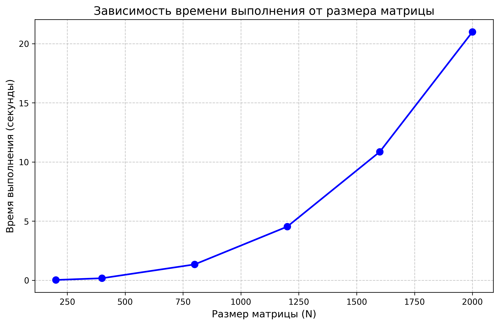

# Лабораторная работа №1: Последовательное перемножение матриц

**Выполнил:** Башаев Артем Алексеевич 
**Группа:** 6213 

## 1. Цель работы
Реализовать базовую (однопоточную) программу на языке C++ для перемножения двух квадратных матриц. Провести исследование зависимости времени выполнения алгоритма от объема задачи (размера матриц) и выполнить автоматизированную верификацию результатов вычислений с помощью библиотек Python.

## 2. Описание реализации
Основной алгоритм реализован в файле `matrix.cpp`. Для вычисления результирующей матрицы используются три вложенных цикла. Замер времени выполнения блока вычислений производится с использованием библиотеки `<chrono>`.

В качестве контроллера тестирования выступает скрипт `verify.py`. Он автоматически генерирует исходные матрицы случайными числами, вызывает скомпилированную C++ программу, парсит время её работы и сверяет полученную матрицу с эталонным результатом, вычисленным через функцию `numpy.dot()`.

## 3. Условия экспериментов
Замеры времени производились для квадратных матриц размером $N \times N$. 
Были исследованы следующие объемы задачи $N$: **200, 400, 800, 1200, 1600, 2000**.
Точность совпадения результатов C++ и Python проверялась с погрешностью `atol=1e-5`.

## 4. Результаты экспериментов

### 4.1. Таблица времени выполнения
Все этапы верификации для указанных размеров были успешно пройдены. Ниже приведено чистое время перемножения матриц (без учета затрат на файловый ввод/вывод).

| Размер матрицы (N) | Время выполнения (сек) |
| :--- | :--- |
| 200 | 0.022905 |
| 400 | 0.169080 |
| 800 | 1.336120 |
| 1200 | 4.528800 |
| 1600 | 10.858200 |
| 2000 | 20.987900 |

### 4.2. График зависимости


### 4.3. Анализ результатов
Теоретическая вычислительная сложность базового алгоритма перемножения квадратных матриц составляет $O(N^3)$. Проанализируем полученные практические данные:

При увеличении размера матрицы в 10 раз (с $N=200$ до $N=2000$) количество математических операций возрастает в $10^3 = 1000$ раз. 
В нашем эксперименте практическое время увеличилось в **916.2 раза** ($20.9879 / 0.0229 \approx 916.3$). 

Анализ промежуточных шагов:
* Увеличение базы в 2 раза (400 к 200): ожидаемый рост времени в 8 раз, фактический — **7.38 раза**.
* Увеличение базы в 4 раза (800 к 200): ожидаемый рост времени в 64 раза, фактический — **58.3 раза**.

График времени строго подчиняется кубической функции $O(N^3)$ без аномальных задержек на работу с оперативной памятью.

## 5. Выводы
1. Разработана и успешно протестирована программа для перемножения матриц. 
2. Настроена автоматизированная система генерации тестов и верификации через Python/NumPy, подтвердившая 100% математическую корректность C++ кода.
3. Проведенный анализ показал, что алгоритм имеет кубическую сложность $O(N^3)$.

## 6. Инструкция по сборке и запуску
Компиляция C++ кода (рекомендуется использовать флаг оптимизации `-O3`):
```bash
g++ -O3 matrix_mult_seq.cpp -o matrix_mult_seq